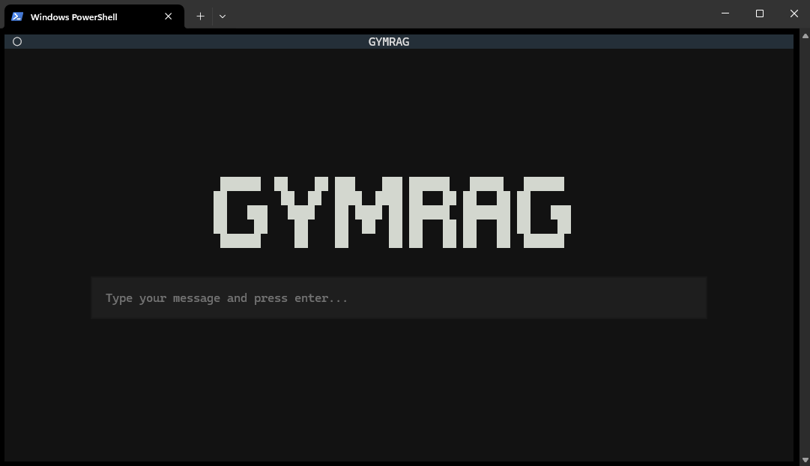

# Textual Azure RAG-sovellus

Tämä on Textual-pohjainen terminaalisovellus, joka yhdistää Azure RAG -ratkaisuun.

## Näkymät

### Startup-ruutu



### Keskustelu-näkymä


## Lataa repositorio
```
git clone https://github.com/ekkulehto/textual-azure-rag
cd textual-azure-rag
```
## Python-ympäristö

Suositeltavaa on luoda erillinen virtuaaliympäristö.

Windows:
```
python -m venv .venv
.venv\Scripts\activate
```

macOS / Linux:
```
python3 -m venv .venv
source .venv/bin/activate
```

## Riippuvuuksien asennus
```
pip install -r requirements.txt
```

## Aseta ympäristömuuttujat

1. Kopioi `.env.example` tiedosto uudeksi tiedostoksi nimeltä `.env`
2. Avaa `.env` ja täydennä omat Azure-avaimet ja muut asetukset

```
cp .env.example .env
```

## Sovelluksen ajaminen

Kun ympäristö on asetettu ja riippuvuudet asennettu, aja sovellus seuraavasti:

```
python main.py
````